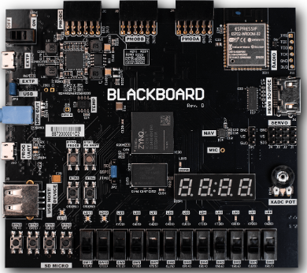
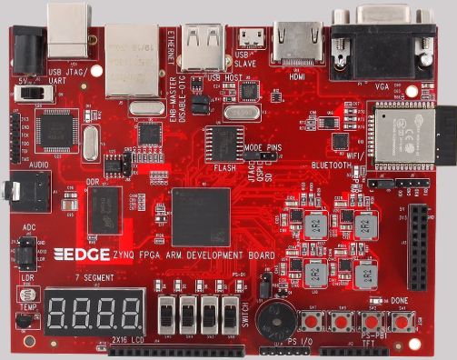
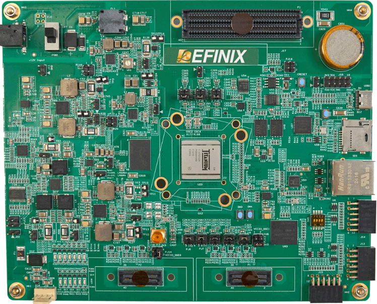
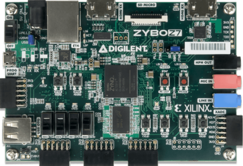
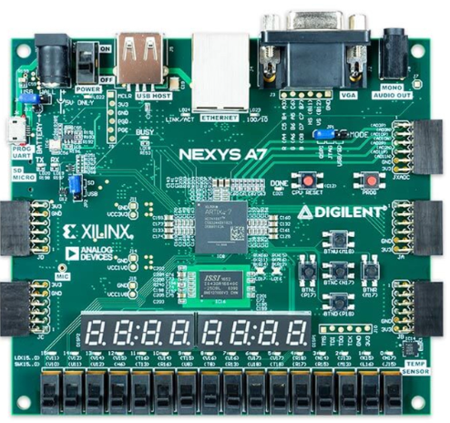

# Development Board Selection

With an entire market of development boards out there, it was overwhelming choosing what board I should get. My initial search for boards left me paralyzed from indecision because all these different boards
had their wildly different specs making them more equipped to handle certain tasks. I noticed that many were specialized for IOT, while others for AI use. That's when I decided to make a list of features
that I wanted my board to be equipped with. Here is what I came up with:

- FPGA
- Microcontroller
- Wireless Communication (BLE preferred)
- Microphone
- Max $450

Although not all of these are necessary for my current project, I wanted to include some "nice to haves" in my list that may become useful in future projects. Upon my search, I noticed that wireless
communication in FPGA dev boards were reletavely uncommon, so I narrowed my search to dev boards with wireless communication as this was my limiting factor. Below is a list of boards I found.

### [1. Real Digital Blackboard](https://www.realdigital.org/hardware/blackboard)

- $184 ($149 for students)
- Artix FPGA and ARM Cortex A9
- SPI, I2C
- Wifi and Bluetooth (No BLE)
- Microphone

### [2. EDGE ZYNQ SoC FPGA Dev Board](https://allaboutfpga.com/product/edge-zynq-soc-fpga-development-board/)

- $245
- Two ARM Cortex A9 in ZYNQ FPGA
- JTAG Programming

### [3. Titanium Ti375 C529 Dev Kit](https://www.efinixinc.com/products-devkits-titaniumti375c529.html)

- $450
- FPGA Prototyping
- Embedded System Design
- AI Applications

### [4. Zybo Z7: Zynq-7000 ARM/FPGA SoC Dev Board](https://digilent.com/shop/zybo-z7-zynq-7000-arm-fpga-soc-development-board/)

- $400 ($300 Zybo Z7-10 Preferred)
- Embedded Software and Digital Circuit development
- Include ARM Cortex-A9 microcontroller
- I2C, UART, SPI, CAN

### [5. Nexys A7 AMD 7 FPGA Trainer Board](https://digilent.com/shop/nexys-a7-amd-artix-7-fpga-trainer-board-recommended-for-ece-curriculum/)

- $350
- Built for ECE Curriculum Students
- LOTS of on board peripherals

## My Decision

Before deciding which dev board to buy, I emailed one of my Embedded Systems professors, asking what he recommended I should get. He told me that I should look for ZYNQ chips, as many companies in 
the industry use them, and that I can get a microphone and LED driver circuit if no board fit exactly what I wanted. I originally went with the second option (EDGE ZYNQ SoC FPGA Dev Board)
because it had a BLE module, however, due to the tariffs, the cost of shipping was much more than the board itself. That's when I went with the Real Digital Blackboard because it had everything else I wanted,
it was produced in the US, and the already cheap price was made cheaper with my UCSD student email. The cherry on top was that since the Blackboard is meant for students, Real Digital provides courses
on FPGA, microcontroller, and FPGA + microcontroller development allowing me to start off with simpler projects and build my way up.
